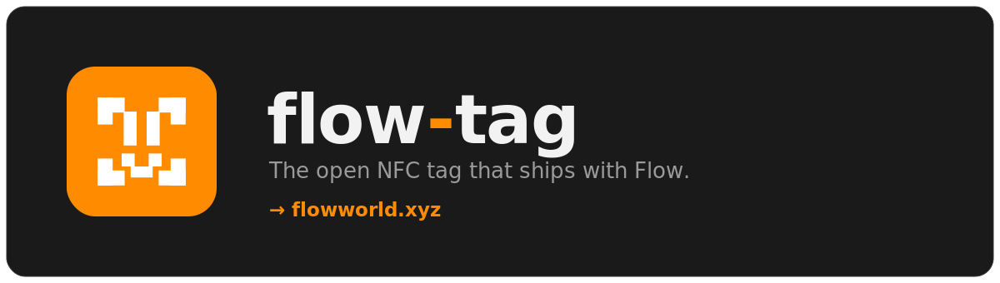

<!-- flow-tag -->
<p align="center">
  <a href="https://floworld.xyz"></a>
</p>

<p align="center">
  <strong>A free, open-source NFC tag that ships in the box with <a href="https://floworld.xyz">Flow</a>.</strong><br>
  Comes preloaded. Fully rewritable. No lock-in, no app, no account.
</p>

<p align="center">
  <code>NTAG21x</code> &nbsp;·&nbsp; <code>NDEF</code> &nbsp;·&nbsp; <code>MIT</code> &nbsp;·&nbsp; <a href="https://floworld.xyz"><strong>floworld.xyz →</strong></a>
</p>

---

## What is this?

It's a sticker with a chip in it. We put it in the Flow box for free.

Out of the box it's preconfigured with a demo payload — tap it and it just opens [floworld.xyz](https://floworld.xyz). That's only a default so the thing does *something* the second you unwrap it. The point isn't the payload. The point is that **the tag is yours** — every byte on it is rewritable, the format is a documented open standard, and this repo hands you everything you need to turn it into whatever you want.

No proprietary encoding. No cloud dependency. No "sign in to configure." It's an NTAG21x chip speaking plain NDEF, the same standard your phone already knows. If you can tap it, you can rewrite it.

Flow is open hardware — ESP32, 3D-printed shell, fully hackable. This tag is the same philosophy shrunk down to 25mm. Consider it a business card that says *we sweat the details and we don't hide the source*.

## Why you might care

- **It's already programmable.** Every modern phone can rewrite it. No reader, no toolchain, no soldering.
- **It's a real spec, not a gimmick.** NDEF records are documented [right here](docs/ndef-spec.md). Read them, break them, extend them.
- **It pairs with Flow.** Map a tap to a Flow macro and your desk becomes a launchpad. See [`examples/flow-macro.md`](examples/flow-macro.md).
- **It's MIT.** Fork the payloads, ship your own, sell them, whatever. [LICENSE](LICENSE).

## Preconfigured ≠ locked

Read this part twice, because it's the whole idea.

The tag arrives **flashed with a working default**. You do not have to do anything — tap it and it works. But nothing on it is permanent, protected, or ours. The moment you want it to do something else, you overwrite it in about ten seconds with a free app you already trust. The default is a starting point, not a cage.

```
┌──────────────────────────────────────────────────┐
│  SHIPPED STATE            →   YOUR STATE           │
│  the floworld.xyz link     →   literally anything   │
│  (read-only? no.)          →   (rewrite freely)     │
└──────────────────────────────────────────────────┘
```

## Quick start

**Just want to use it?** Tap it against your phone. Done. That's the whole tutorial.

**Want to make it yours?** Sixty seconds:

1. Install a writer app — [NFC Tools](https://www.wakdev.com/en/apps.html) (iOS/Android) is the easy default.
2. Open the app, pick **Write → Add a record**.
3. Choose a record type — a URL, some text, a Wi-Fi login, a Flow trigger. Grab a ready-made one from [`examples/`](examples/).
4. Hold the tag to the back of your phone until it buzzes.
5. Tap it again to confirm. It now does the new thing.

Full platform-by-platform walkthrough (iOS, Android, desktop/PN532, CLI): [`docs/install.md`](docs/install.md).

## How to hack it

This is the fun part and the reason the repo exists.

- **Change what it points to** → [`docs/customize.md`](docs/customize.md)
- **Understand the bytes** → [`docs/ndef-spec.md`](docs/ndef-spec.md)
- **Chip capabilities & memory map** → [`hardware/README.md`](hardware/README.md)
- **Copy-paste payloads** (URL, Wi-Fi, vCard, Flow macro, raw NDEF) → [`examples/`](examples/)
- **Write from your laptop instead of your phone** → [`tools/write-tag.py`](tools/write-tag.py)

Ideas people have already done with theirs: instant Wi-Fi handoff for guests, a tap-to-launch dev environment via Flow, a doorbell that texts them, a vinyl record that opens its own Bandcamp page, a gym locker that logs a set. The chip doesn't care. Neither do we.

## Repo layout

```
flow-tag/
├── README.md              ← you are here
├── LICENSE                ← MIT
├── assets/                ← banner + logo (SVG source, editable — yes, even the art is open)
├── docs/
│   ├── how-it-works.md    ← NFC + NDEF in plain English
│   ├── install.md         ← writer setup for every platform
│   ├── customize.md       ← change the payload, step by step
│   └── ndef-spec.md       ← the actual record format
├── examples/
│   ├── url.md             ← open a link
│   ├── wifi.md            ← join a network on tap
│   ├── vcard.md           ← share contact details
│   ├── flow-macro.md      ← trigger a Flow action
│   └── default.ndef      ← the shipped default, as a file
├── hardware/
│   └── README.md          ← chip specs, memory, sourcing
├── payloads/
│   └── default.json       ← human-readable source of the default
└── tools/
    └── write-tag.py       ← flash a tag from a laptop (PN532)
```

## FAQ, compressed

**Do I need the Flow device to use the tag?** No. It's a standard NFC tag; any phone reads it. Flow just unlocks the tap-to-macro tricks.

**Will I brick it?** Practically no. Worst case you write garbage and overwrite it again. The user memory is rewritable ~100,000 times.

**Can I make it read-only?** Yes — NTAG21x supports a permanent lock bit. Don't set it unless you mean *forever*. See [`hardware/README.md`](hardware/README.md).

**Is my data going to a server?** Nothing here phones home. A URL record just opens a browser; where *that* goes is on you.

**Where do I get more tags?** Any NTAG213/215/216 sticker works. Or [buy another Flow](https://floworld.xyz) and get one free — we're not subtle about it.

## Contributing

Got a clever payload or a platform guide we missed? PRs welcome. Keep examples copy-pasteable and the tone honest.

---

<p align="center">
  Built by the people making <a href="https://floworld.xyz"><strong>Flow</strong></a> — open hardware for people who like to open things.<br>
  <a href="https://floworld.xyz">floworld.xyz</a>
</p>
